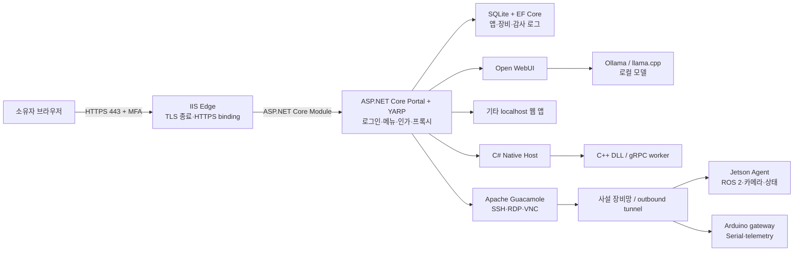

# My Web — 개인용 Self-hosted Web Gateway

> 상태: 1차 MVP 기반 구현 진행 중 / 2026-08-11
> 대상 환경: Windows 호스트, ASP.NET Core 기반, 외부 HTTPS 접속, 단일 소유자 운영

## 1. 목표

`My Web`은 로컬 PC나 내부망의 여러 웹 서비스와 개발 장비를 한곳에서 찾아 안전하게 사용하는 개인용 포털이다.

- 로그인한 소유자만 로컬 웹 앱에 접근한다.
- 새 앱은 코드 수정 없이 이름, 내부 URL, 아이콘 등의 등록만으로 메뉴에 추가한다.
- 외부에는 하나의 HTTPS 진입점만 공개하고 로컬 서비스 포트는 직접 노출하지 않는다.
- Open WebUI와 Ollama 같은 로컬 AI 도구를 메뉴에서 실행한다.
- C#을 중심으로 운영하되 C++ Native Host와 장비 Agent를 함께 개발한다.
- 2차에는 Jetson Orin Nano, Arduino, ROS 2, VLM/VLA 실습 환경을 안전하게 연결한다.

### 현재 구현된 범위

- .NET 10 Portal solution, Razor Pages 로그인 UI, ASP.NET Core Identity + SQLite
- DB 기반 App Registry CRUD, 동적 좌측 메뉴, 상태 확인과 재시작 없는 YARP route 갱신
- IIS 외부 443과 분리된 loopback 기본 포트 `17831..17836`
- config 파일, `MYWEB_` 환경변수, 명령행 override와 시작 시 검증
- interactive 최초 소유자 bootstrap과 public registration 차단
- `env/`의 Windows/IIS/무료 HTTPS/Docker/GitHub 단계별 가이드
- Open WebUI용 loopback-only Docker Compose 초안
- EF Core 초기 migration과 endpoint/proxy/registry 자동화 테스트 17개
- TOTP 설정, 일회성 복구 코드, 미설정 계정의 강제 보안 설정 흐름
- monorepo용 GitHub CI/Release workflow template과 설치 스크립트
- locked dependency 기반 Windows publish와 read-only 환경 진단 스크립트

빠른 시작은 [환경 설정 가이드](env/README.md)를 번호 순서대로 따른다.

## 2. 가장 중요한 보안 원칙

포털은 단순 링크 모음이 아니라 **모든 요청이 반드시 통과하는 인증 게이트웨이**여야 한다.

1. 인터넷에서 접근 가능한 서비스 포트는 TCP 443 하나뿐이다. TCP 80은 IIS의 ACME HTTP-01 검증과 HTTPS redirect에만 사용한다.
2. Kestrel, Ollama, Open WebUI 및 로컬 앱은 `127.0.0.1` 또는 전용 내부망에만 바인딩한다.
3. Windows 방화벽과 공유기에서 앱별 포트를 외부에 공개하지 않는다.
4. 모든 프록시 라우트에는 기본적으로 `OwnerOnly` 정책을 적용한다. 익명 라우트는 `/health/live` 정도로 제한한다.
5. 회원가입은 제공하지 않는다. 최초 관리자 계정은 로컬 콘솔의 일회성 bootstrap 명령으로만 만든다.
6. 비밀번호와 함께 TOTP 2단계 인증을 필수로 사용하고 복구 코드는 오프라인 보관한다.
7. 브라우저 콘솔, SSH, RDP, ROS 제어는 일반 웹 화면보다 높은 `SensitiveAccess` 정책과 재인증을 요구한다.
8. VLA/모터 제어는 읽기 전용 관측 기능과 분리한다. 허용 명령, 속도/범위 제한, 타임아웃, 물리적 비상 정지 장치가 준비되기 전에는 원격 구동하지 않는다.

> 포털 화면만 로그인으로 감싸고 `localhost:3000`, `11434` 같은 실제 서비스 포트를 인터넷에 열면 로그인은 쉽게 우회된다.

## 3. 제안 아키텍처



### 계층과 책임

| 구성요소 | 기술 | 책임 |
|---|---|---|
| Edge | IIS + win-acme | 공개 80/443, Let’s Encrypt 인증서, HTTPS redirect, ASP.NET Core process 관리 |
| Portal/Gateway | ASP.NET Core + Blazor Web App + YARP | 로그인, 좌측 메뉴, 앱 등록, 정책 기반 인가, WebSocket/SSE 프록시 |
| Application Registry | EF Core + SQLite | 앱/장비/라우트/상태검사/표시 순서 저장 |
| Background Worker | .NET Hosted Service | 상태검사, 감사 로그 정리, 장비 heartbeat, 선택적 프로세스 상태 확인 |
| Native Host | 별도 .NET Worker Process | C++ 호출 API 제공, timeout/재시작, 웹 프로세스와 native crash 격리 |
| C++ Core | CMake + vcpkg, C ABI 또는 gRPC | 영상 처리, 센서 parsing, 성능 실험, 단위 테스트 |
| Device Agent | .NET Linux ARM64 또는 C++ | Jetson/장비에서 outbound 연결, 명령 allowlist, telemetry 전달 |
| Remote Console | Apache Guacamole | 브라우저 기반 SSH/RDP/VNC; 자격 증명과 연결 대상은 별도 보호 |

### 배포 토폴로지

기본안은 도메인이 현재 Windows PC의 공인 IP를 가리키고, 공유기가 80/443만 IIS 호스트로 전달하는 방식이다.

```text
Internet → 공유기/NAT(80,443만) → IIS(:443) → ASP.NET Core Portal/YARP
                                        └→ 127.0.0.1:17832..17836 services
```

- Portal은 IIS in-process hosting을 기본으로 하며 App Pool은 `AlwaysRunning`, idle timeout 0, preload enabled로 설정한다.
- 로컬 개발/out-of-process Portal은 `127.0.0.1:17831`만 listen한다.
- Open WebUI, Native Host 등 내부 서비스 포트는 loopback 또는 장비 사설망 전용이다.
- ISP가 inbound 포트를 차단하거나 CGNAT 환경이면 직접 공개 대신 Cloudflare Tunnel 또는 사설 VPN 방식을 검토한다.
- “나만 사용”이 절대 조건이면 공인 인터넷 로그인보다 Tailscale/WireGuard 같은 사설망을 한 겹 더 두는 구성이 가장 안전하다. 도메인 HTTPS와 병행할 수 있다.
- Cloudflare Tunnel 사용 여부는 외부 업체 의존성, DNS 운영 방식, 실제 공인 IP/CGNAT 여부를 확인한 뒤 결정한다.

## 4. 설정 파일과 최초 실행

도메인과 설치 환경은 소스 코드에 넣지 않는다. 같은 release artifact를 개발 PC, 운영 Windows PC, 다른 도메인에서 그대로 실행할 수 있도록 .NET Configuration을 사용한다.

### 설정 파일 구성

```text
my_web/
├─ config/
│  ├─ appsettings.json                    # Git 추적: 안전한 공통 기본값
│  └─ appsettings.Production.example.json # Git 추적: 운영 설정 예제와 설명
├─ deploy/
│  └─ iis/site-template.ps1               # Git 추적 예정: IIS site/app pool 설정
└─ .env.example                           # Git 추적: 환경변수 이름만, 실제 값 없음

C:\ProgramData\MyWeb\
├─ config\appsettings.Production.json     # Git 제외: 실제 도메인/호스트 설정
├─ secrets\                               # Git 제외: DPAPI 보호 key/reference
├─ data\                                  # SQLite, Data Protection keys
├─ logs\
└─ releases\                              # 현재/이전 version과 rollback 대상
```

운영 설정의 우선순위는 `명령행 인자 > 환경변수 > ProgramData 운영 파일 > repository 기본값`으로 고정한다. 환경변수는 `MYWEB_` prefix와 .NET 표준의 이중 밑줄 표기, 예를 들어 `MYWEB_MyWeb__PublicUrl`을 사용한다. 시작 시 strongly typed options로 binding하고 필수값, URL, host, CIDR을 검증한다. 잘못된 설정이면 일부 기능만 조용히 실패시키지 말고 service 시작을 중단하고 원인을 로그에 남긴다.

```json
{
  "MyWeb": {
    "PublicUrl": "https://portal.example.com",
    "PortalHost": "portal.example.com",
    "AppsWildcardHost": "*.apps.example.com",
    "DefaultRouteMode": "Path",
    "EdgeMode": "IIS",
    "AllowedProxyCidrs": ["127.0.0.1/32", "::1/128"]
  },
  "Tls": {
    "Provider": "LetsEncrypt",
    "AcmeClient": "win-acme",
    "AcmeEmail": "owner@example.com",
    "HttpChallengeEnabled": true
  }
}
```

- 도메인명과 공개 URL은 보통 비밀이 아니므로 운영 config에 둘 수 있다.
- DNS API token, tunnel token, 관리자 암호, SSH private key는 JSON/.env/GitHub artifact에 저장하지 않는다. Windows Credential Manager 또는 DPAPI로 보호한 secret store에 저장하고 config에는 reference만 둔다.
- `appsettings.Production.example.json`에는 실제 사용자가 채워야 하는 모든 항목과 유효한 예시를 유지한다.
- repository의 `.gitignore`에는 `appsettings.Production.json`, `.env`, 인증서/private key, DB, backup, log를 명시한다.
- IIS binding과 win-acme renewal은 bootstrap이 기존 설정을 backup하고 사전 검증한 뒤 변경한다.

### 한 번의 최초 실행 흐름

관리자 PowerShell에서 다음과 같은 진입점 하나를 제공하는 것을 목표로 한다.

```powershell
.\scripts\bootstrap.ps1 -ConfigPath .\config\appsettings.Production.json
```

`bootstrap.ps1`은 재실행해도 안전한 idempotent script로 작성하며 다음 순서로 동작한다.

1. Windows/.NET Hosting Bundle/IIS/win-acme와 관리자 권한, 포트 점유, config schema를 사전 검사한다.
2. `C:\ProgramData\MyWeb` 디렉터리와 최소 권한 service account/ACL을 준비한다.
3. 아직 config가 없으면 example을 복사하고 사용자가 채울 항목을 출력한 뒤 종료한다.
4. release 파일을 version directory에 설치하고 EF migration 전 DB/key backup을 만든다.
5. bootstrap admin을 interactive prompt로 생성한다. 명령행 인자나 shell history로 암호를 받지 않는다.
6. IIS site/app pool을 생성하거나 갱신하고 win-acme의 인증서와 HTTPS binding을 확인한다.
7. loopback health check, HTTPS check, 외부 노출 포트 점검 결과를 요약한다.

`doctor.ps1`은 언제든 DNS resolution, 인증서 만료일, IIS/App Pool 상태, DB 쓰기 권한, Portal health, disk 여유 공간, backup 최신성을 읽기 전용으로 진단해야 한다.

## 5. 라우팅과 앱 자동 추가

### 두 가지 라우팅 모드

| 모드 | 예시 | 장점 | 제한 |
|---|---|---|---|
| `Path` (기본) | `https://portal.example.com/apps/open-webui/` | 단일 호스트/쿠키/인증서, MVP가 단순함 | 앱이 base path, 절대 URL, Service Worker를 제대로 지원해야 함 |
| `Host` (호환 모드) | `https://open-webui.apps.example.com/` | 대부분의 기존 앱과 WebSocket 호환성이 좋음 | wildcard DNS/인증서와 서브도메인 SSO 정책 필요 |

모든 앱을 iframe 안에 넣는 방식은 기본값으로 사용하지 않는다. `X-Frame-Options`, CSP, 카메라/마이크 권한, 로그인 쿠키 때문에 깨지는 앱이 많다. 메뉴 선택 시 같은 탭의 프록시 URL로 이동하고, 호환되는 앱만 선택적으로 iframe/새 탭 표시를 허용한다.

### 앱 등록 필드

```yaml
name: Open WebUI
slug: ai
internalUrl: http://127.0.0.1:3000
routeMode: Host              # Path | Host
icon: bot
category: AI
enabled: true
authorizationPolicy: OwnerOnly
healthPath: /health
supportsWebSocket: true
stripPathPrefix: false
openMode: SameTab            # SameTab | NewTab | IFrame
sortOrder: 10
```

등록 API는 내부 URL을 무조건 신뢰하면 SSRF가 되므로 다음 검증을 수행한다.

- `http`/`https`만 허용하고 URL에 사용자명/비밀번호를 넣지 않는다.
- 기본 허용 대상은 loopback 및 사전에 등록된 사설 CIDR뿐이다.
- link-local, metadata endpoint, 임의 공인 IP는 차단한다.
- 관리 화면에서 연결 시험과 상태검사를 한 뒤 활성화한다.
- YARP 라우트는 DB 변경 후 동적 config provider로 reload하며 프로세스를 재시작하지 않는다.
- `OwnerOnly`를 생략할 수 없게 하고 익명 정책은 소스 코드 allowlist로만 허용한다.

### 추천 데이터 모델

- `OwnerUser`: ASP.NET Core Identity 사용자. MVP에서는 정확히 한 명만 활성화한다.
- `AppDefinition`: 위 앱 등록 정보, 상태, 마지막 health check 결과.
- `Device`: 장비 이름, 종류, agent ID, 연결 상태, 마지막 heartbeat.
- `DeviceEndpoint`: SSH/RDP/VNC/ROS/Web UI 등 장비별 endpoint와 정책.
- `AuditEvent`: 로그인, 실패, 앱/장비 변경, 콘솔 접속, 민감 명령 실행 기록.
- `SecretReference`: 비밀값 자체가 아니라 Windows DPAPI/자격 증명 저장소의 key reference만 보관.

## 6. 인증·보안 설계

- ASP.NET Core Identity의 local account를 사용하고 public registration endpoint를 만들지 않는다.
- 비밀번호 정책, 계정 잠금, 로그인 rate limit, TOTP 2FA, 짧은 idle timeout을 적용한다.
- 인증 cookie는 `Secure`, `HttpOnly`, 적절한 `SameSite`를 사용하고 HTTPS가 아니면 발급하지 않는다.
- Data Protection key는 영속 저장하고 Windows DPAPI로 보호한다. 키가 사라지면 모든 세션이 무효화되므로 백업 범위를 명확히 한다.
- POST/PUT/PATCH/DELETE 관리 API에는 anti-forgery 검사를 적용한다.
- 기본 CSP, HSTS, `X-Content-Type-Options`, `Referrer-Policy`, frame 제한을 둔다. 프록시 앱별로 필요한 예외만 추가한다.
- 로그인 성공/실패, IP, 앱 등록 변경, 콘솔 연결, 장비 명령을 감사 로그로 남긴다. 비밀번호, token, prompt 본문은 로그에 남기지 않는다.
- IIS out-of-process나 추가 proxy를 사용할 때 forwarded header는 loopback/명시된 proxy에서 온 것만 신뢰한다.
- 내부 앱의 응답이 gateway 인증 cookie를 덮어쓰지 못하도록 `Set-Cookie` 이름/Domain을 검사하거나 rewrite한다.
- 백업 대상은 DB, Data Protection keys, IIS 설정/인증서 갱신 상태, 앱별 persistent volume이다. 복원 시험이 없는 백업은 완료로 보지 않는다.

### 보안상 명시적인 비목표

- 임의의 executable/컨테이너를 웹 화면에서 root/Administrator 권한으로 실행하는 기능
- 인터넷에서 Ollama API(`11434`), SSH(`22`), RDP(`3389`), ROS bridge 포트를 직접 공개하는 구성
- 브라우저에서 제한 없는 PowerShell/CMD를 SYSTEM 계정으로 실행하는 기능
- 안전장치 없는 VLA 물리 구동

## 7. C# / C++ 구성

예상 solution 구조는 다음과 같다.

```text
my_web/
├─ src/
│  ├─ MyWeb.Portal/             # Blazor UI + Identity + YARP host
│  ├─ MyWeb.Application/        # use cases, policy, validation
│  ├─ MyWeb.Domain/             # AppDefinition, Device, AuditEvent
│  ├─ MyWeb.Infrastructure/     # EF Core, dynamic proxy config, health checks
│  └─ MyWeb.NativeHost/         # 별도 프로세스의 C++ adapter
├─ native/
│  ├─ myweb-native/             # CMake library, C-compatible ABI
│  └─ device-agent/             # 선택: Jetson용 C++ agent
├─ tests/
│  ├─ MyWeb.UnitTests/
│  ├─ MyWeb.IntegrationTests/
│  └─ native-tests/
├─ deploy/
│  ├─ iis/
│  ├─ windows-service/
│  └─ containers/
├─ config/
├─ scripts/
│  ├─ bootstrap.ps1
│  ├─ doctor.ps1
│  ├─ update.ps1
│  └─ rollback.ps1
├─ .github/
│  ├─ workflows/ci.yml
│  ├─ workflows/release.yml
│  ├─ dependabot.yml
│  └─ CODEOWNERS
├─ docs/
└─ README.md
```

C++ DLL을 Portal 프로세스에서 직접 P/Invoke하면 access violation이 웹 서버 전체를 종료할 수 있다. 따라서 운영 경로는 `Portal → localhost gRPC/Named Pipe → NativeHost → C++`의 프로세스 경계를 기본으로 한다. 작은 순수 함수의 ABI 학습용 샘플만 직접 P/Invoke하고, 영상/센서/모델 처리 작업은 Native Host에 둔다.

C++ 학습을 지속하기 위한 첫 모듈은 다음 정도로 제한한다.

- CMake preset과 vcpkg manifest 구성
- C ABI로 `version`, `health`, byte buffer 처리 함수 제공
- C# `SafeHandle`/source-generated interop wrapper
- GoogleTest 또는 Catch2 native test와 .NET integration test
- 이후 OpenCV frame preprocessing 또는 Arduino binary packet parser 추가

## 8. 로컬 AI 기능

1차 AI MVP는 자체 채팅 UI를 새로 만들지 않고 Open WebUI를 등록 앱으로 사용한다.

- Ollama는 host 또는 GPU가 연결된 런타임에서 동작한다.
- Open WebUI는 고정된 버전 tag의 container와 persistent volume으로 실행한다. rolling `main` tag는 운영에서 피한다.
- Open WebUI만 gateway를 통해 노출하고 Ollama API는 내부 전용으로 둔다.
- `WEBUI_URL`, 정확한 `CORS_ALLOW_ORIGIN`, secure cookie를 공개 URL에 맞춘다.
- WebSocket upgrade, SSE streaming, 긴 inference timeout을 gateway 통합 시험에 포함한다.
- Open WebUI 자체 사용자 생성은 끄고 단일 관리자만 사용한다. Gateway 로그인과 앱 자체 로그인을 어떻게 통합할지는 후속 SSO 항목으로 둔다.
- 모델 pull은 저장공간과 공급망 위험이 있으므로 관리자 작업으로 취급하며 모델명, digest, license, 크기를 기록한다.

향후에는 Ollama/OpenAI-compatible endpoint를 직접 호출하는 `MyWeb.AI` 페이지를 추가할 수 있지만 MVP 범위에는 포함하지 않는다.

## 9. 2차: Jetson, Arduino, ROS, 원격 콘솔

### 연결 원칙

장비가 서버로 inbound port를 여는 대신, 장비 Agent가 서버 또는 사설 overlay network로 **outbound 연결**한다. 장비 추가 절차는 다음을 목표로 한다.

1. Portal에서 장비 등록 token을 1회 발급한다.
2. Jetson에서 Agent 설치 명령을 실행한다.
3. Agent가 자신의 ID, OS/architecture, capability를 등록하고 token을 폐기한다.
4. Portal에서 장비를 승인하면 메뉴와 endpoint가 자동 생성된다.
5. 이후에는 짧은 수명의 client credential 또는 mTLS 인증서를 회전한다.

### 단계별 기능

- 관측: CPU/GPU 온도, 메모리, disk, JetPack/ROS 버전, Agent heartbeat.
- 콘솔: Apache Guacamole을 통한 SSH/VNC/RDP. 장비별 low-privilege 계정과 SSH key를 사용한다.
- ROS: `rosbridge_suite` WebSocket 또는 Foxglove Bridge를 장비 내부에서 실행하고 gateway 뒤에서만 접근한다.
- 영상: 초기에는 저해상도 snapshot/MJPEG 관측, 이후 WebRTC 기반 저지연 스트림 검토.
- Arduino: Jetson/Windows의 Agent가 serial port를 소유하고 typed telemetry와 허용된 명령만 중계한다.
- 파일/배포: signed artifact 업로드와 versioned rollout을 별도 단계로 추가한다.
- VLM: 카메라 frame 수집 → Jetson inference → 결과/latency/overlay를 Portal에서 관측한다.
- VLA: read-only simulation → dry-run → 제한된 실기 순으로 승격하며 physical E-stop과 watchdog을 필수로 한다.

Apache Guacamole의 ad-hoc connection URI는 편리하지만 사용자가 임의 host/drive redirection을 지정할 수 있어 MVP에서는 끄고, 관리자가 등록한 connection만 노출한다.

## 10. GitHub 연동과 지속 배포

현재 상위 repository는 `https://github.com/hundong2/blazor.git`의 `main`에 연결되어 있다. 초기에는 이 repository의 `my_web/` 하위 프로젝트로 개발하고, 독립적인 issue/release 주기가 필요해지면 별도 repository로 분리할 수 있다.

### Git 운영 규칙

- `main`은 언제나 배포 가능한 상태로 유지하고 직접 push 대신 feature branch와 Pull Request를 사용한다.
- branch protection으로 필수 CI, review, 최신 main 반영을 요구한다.
- commit에는 source와 migration만 포함하며 운영 config, token, DB, 모델, binary build output은 포함하지 않는다.
- release는 immutable tag(`v0.1.0`)에서 만들고 운영 서버는 branch나 `latest` artifact가 아니라 명시적인 release version을 설치한다.
- Conventional Commits 또는 일관된 commit 분류를 사용하고 release notes를 자동 생성한다.

### GitHub Actions

`ci.yml`은 PR과 main push에서 실행한다.

1. 고정된 .NET SDK와 dependency cache를 준비한다.
2. restore lock 검증, format/analyzer, build, .NET unit/integration test를 수행한다.
3. Windows runner에서 CMake/vcpkg C++ build와 native test를 수행한다.
4. config example schema와 IIS deployment script validation test를 수행한다.
5. CodeQL(C# 및 C++), dependency review, secret scanning을 적용한다.
6. PR에서 실제 배포, DNS 변경, 운영 migration은 절대 수행하지 않는다.

`release.yml`은 `v*` tag 또는 승인된 수동 실행에서만 동작한다.

1. `win-x64` self-contained Portal/NativeHost를 clean build한다.
2. migration bundle, bootstrap/update/rollback/doctor script, config example, IIS deployment script를 포함한다.
3. dependency lock file과 SBOM을 생성한다.
4. ZIP과 SHA-256 checksum을 만들고 가능하면 code-signing/signing provenance를 추가한다.
5. GitHub Release를 먼저 draft로 만들고 smoke test 후 공개한다.

### 운영 서버 업데이트와 롤백

GitHub-hosted runner가 가정의 Windows 서버에 inbound 접속하거나 관리자 권한으로 배포하지 않는다. 기본 배포는 서버가 GitHub Release를 가져오는 pull 방식이다.

```powershell
.\scripts\update.ps1 -Version v0.2.0
.\scripts\rollback.ps1
```

`update.ps1`은 다음을 원자적으로 수행한다.

1. GitHub Release의 정확한 version artifact와 checksum/signature를 다운로드한다.
2. hash/signature, 지원 OS/architecture, config schema 호환성을 검증한다.
3. DB, Data Protection keys, 현재 release pointer를 backup한다.
4. 새 version directory에 압축을 풀고 dry-run migration/smoke test를 수행한다.
5. service를 짧게 중지하고 `current` pointer를 바꾼 후 시작한다.
6. local health check와 HTTPS smoke test가 실패하면 즉시 이전 pointer/DB로 rollback한다.
7. 성공한 version, Git SHA, migration, 수행자를 audit log에 기록한다.

자동 업데이트가 필요하면 Windows Scheduled Task가 GitHub Releases를 확인하되, 기본 channel은 stable만 허용하고 patch release만 자동 적용한다. major/minor와 DB destructive migration은 수동 승인을 요구한다. self-hosted GitHub Actions runner는 repository write token과 운영 secret이 탈취될 위험이 있어 MVP에서는 사용하지 않는다. 추후 도입 시 전용 저권한 계정, fork PR 차단, ephemeral runner를 별도 설계한다.

## 11. MVP 완료 기준과 TODO

### Phase 0 — 도메인·네트워크 결정

- [ ] `appsettings.Production.example.json`의 도메인/네트워크 항목을 채운다.
- [ ] ISP/공유기가 공인 IPv4 또는 사용 가능한 IPv6를 제공하는지, CGNAT인지 확인한다.
- [ ] `직접 공개(IIS + port forwarding)`와 `managed tunnel/사설망` 중 배포 방식을 결정한다.
- [ ] portal hostname과 wildcard app hostname 사용 여부를 결정한다.
- [ ] 위협 모델과 외부 공개 포트 목록을 문서로 승인한다.

완료 기준: 외부 DNS → Edge → Kestrel 흐름과 방화벽 규칙을 한 장의 배포 문서로 재현할 수 있다.

### Phase 0.5 — Config/bootstrap/GitHub 기반

- [x] strongly typed config model, validation, precedence를 구현한다.
- [x] example config, `.env.example`, secret-safe `.gitignore`를 추가한다.
- [ ] IIS site/app pool script와 validation test를 작성한다.
- [ ] idempotent `bootstrap.ps1`과 read-only `doctor.ps1`을 구현한다.
- [ ] `ci.yml`에 .NET/C++/config/security 검사를 추가한다.
- [ ] `release.yml`에 versioned ZIP, checksum, SBOM, draft release 생성을 추가한다.
- [ ] `update.ps1`과 `rollback.ps1`의 artifact 검증/backup/health rollback을 구현한다.
- [ ] GitHub `main` branch protection과 Dependabot을 설정한다.

완료 기준: 새 Windows VM에서 example config만 채운 뒤 bootstrap하여 실행할 수 있고, GitHub Release의 특정 version으로 갱신했다가 이전 version으로 복원할 수 있다.

### Phase 1 — Portal/Auth 기반

- [ ] 지원 중인 .NET LTS SDK로 solution과 프로젝트를 scaffold한다.
- [ ] Blazor Web App shell, 반응형 좌측 메뉴, 로그인/로그아웃 화면을 만든다.
- [x] ASP.NET Core Identity + SQLite migration을 구성한다.
- [x] public registration을 제거하고 local bootstrap admin 명령을 만든다.
- [x] TOTP 2FA, recovery code, lockout, idle timeout을 구현한다.
- [ ] 로그인 endpoint의 request rate limiting을 추가한다.
- [x] persistent Data Protection key + DPAPI 보호를 구성한다.
- [x] `OwnerOnly`, `SensitiveAccess` policy와 기본 fallback authorization을 추가한다.
- [ ] 인증/인가 unit 및 integration test를 작성한다.

완료 기준: 익명 사용자는 모든 포털/프록시 앱에서 거부되고, bootstrap한 단일 소유자는 TOTP를 거쳐 로그인한다.

### Phase 2 — App Registry와 YARP

- [x] `AppDefinition` schema, EF migration, CRUD 관리 화면을 만든다.
- [x] loopback URL/port/slug 검증과 1차 SSRF 방어를 구현한다.
- [x] DB 기반 YARP dynamic configuration provider를 구현한다.
- [ ] `Path` routing, prefix transform, WebSocket/SSE를 지원한다.
- [x] 상태검사 worker와 메뉴 online/offline badge를 만든다.
- [ ] 메뉴 정렬, category, icon, same-tab/new-tab/iframe 옵션을 제공한다.
- [ ] 등록/수정/삭제 audit log를 남긴다.
- [ ] 호환되지 않는 앱을 위한 `Host` routing 설계와 cookie 격리를 시험한다.

완료 기준: 테스트용 localhost 앱 두 개를 재시작 없이 추가/수정/비활성화하고, 외부에서는 gateway URL로만 접근할 수 있다.

### Phase 3 — Windows HTTPS 운영

- [ ] IIS site/app pool/binding script를 작성하고 idempotent test를 자동화한다.
- [ ] Portal을 최소 권한 App Pool identity로 실행한다.
- [ ] DNS와 NAT/방화벽을 설정하고 유효한 공인 인증서를 발급한다.
- [ ] HTTP→HTTPS, HSTS, forwarded headers, WebSocket/SSE를 시험한다.
- [ ] 서비스 자동 시작, crash recovery, structured log rotation을 구성한다.
- [ ] DB/keys/config backup 및 실제 restore test를 수행한다.
- [ ] 외부 네트워크에서 443 외 앱 포트가 닫혔는지 검사한다.

완료 기준: Windows 재부팅 후 자동 복구되며 외부 모바일 네트워크에서 MFA 로그인과 등록 앱 사용이 가능하다.

### Phase 4 — Open WebUI/Ollama

- [ ] GPU/VRAM/RAM/disk를 조사하고 첫 모델 크기를 정한다.
- [ ] Ollama를 내부 interface에만 바인딩한다.
- [ ] version-pinned Open WebUI와 persistent volume을 배포한다.
- [ ] Open WebUI를 Registry에 추가하고 외부 URL/CORS/secure cookie를 설정한다.
- [ ] token streaming, WebSocket, 5분 이상 inference, 파일 upload를 시험한다.
- [ ] Gateway와 Open WebUI의 이중 로그인 또는 SSO 방향을 결정한다.
- [ ] 모델 이름/digest/license/저장공간 inventory를 만든다.

완료 기준: 외부 브라우저에서 Portal 로그인 후 로컬 모델을 선택해 streaming 응답을 받고 Ollama API에는 직접 접근할 수 없다.

### Phase 5 — C++ Native MVP

- [ ] CMake preset, vcpkg manifest, native test project를 만든다.
- [ ] version/health/buffer API를 가진 첫 C++ library를 구현한다.
- [ ] 별도 `MyWeb.NativeHost`와 IPC 계약을 구현한다.
- [ ] timeout, cancellation, malformed input, native crash 후 재시작을 시험한다.
- [ ] Portal에 Native module health/version 페이지를 추가한다.

완료 기준: C++ module을 빌드·테스트·호출할 수 있고, 의도적으로 Native Host를 종료해도 Portal은 계속 동작한다.

### Phase 6 — Device/ROS 원격 접근 (2차)

- [ ] `Device`, `DeviceEndpoint`, enrollment token schema를 설계한다.
- [ ] Jetson용 outbound Agent prototype과 heartbeat를 구현한다.
- [ ] 장비 승인/폐기/credential rotation UI를 만든다.
- [ ] Guacamole을 고정 version container로 배포하고 등록 connection만 허용한다.
- [ ] SSH 콘솔에 `SensitiveAccess`, 짧은 session, audit event를 적용한다.
- [ ] ROS 2 telemetry를 read-only로 연결하고 topic/service allowlist를 적용한다.
- [ ] Arduino serial telemetry adapter와 reconnect를 구현한다.
- [ ] 카메라 snapshot/stream과 VLM 결과 overlay prototype을 만든다.
- [ ] 네트워크 단절, 장비 탈취, token 재사용, command replay test를 수행한다.
- [ ] VLA 이전에 E-stop, watchdog, command envelope, simulation gate를 검증한다.

완료 기준: 새 Jetson을 일회성 token으로 등록해 상태와 제한된 SSH/ROS telemetry를 Portal에서 보고, 장비를 폐기하면 즉시 재연결이 거부된다.

## 12. 1차 MVP에서 의도적으로 미루는 항목

- 여러 사용자/조직/세밀한 RBAC
- Kubernetes 및 고가용성 cluster
- Portal에서 임의 Docker image를 내려받아 자동 실행하는 marketplace
- 완전한 SSO provider 구축
- 모바일 native app
- VLA 실물 actuator 원격 제어

처음부터 이 기능을 넣으면 공격 표면과 운영 복잡도가 크게 늘어난다. 단일 사용자, 수동 설치된 앱의 안전한 등록, HTTPS, 복구 가능성부터 검증한다.

## 13. 실제 HTTPS 배포 전에 config로 입력할 정보

구현 시작에는 실제 값이 필요 없다. Phase 0/3에서 아래 값을 `appsettings.Production.json` 또는 bootstrap prompt로 입력한다. 비밀번호, API token, private key는 config나 채팅에 넣지 않고 secret store에 등록한다.

1. 사용할 루트 도메인 또는 위임 가능한 서브도메인. 예: `example.com` 또는 `home.example.com`.
2. 원하는 Portal 주소. 예: `portal.example.com`.
3. DNS 제공업체 이름과 DNS record 수정 권한 보유 여부.
4. wildcard record/certificate(`*.apps.example.com`) 사용 가능 여부.
5. Windows PC가 있는 회선의 공인 IPv4/IPv6 또는 DDNS 필요 여부, CGNAT 여부.
6. 공유기에서 TCP 80/443 port forwarding 가능 여부.
7. Cloudflare Tunnel/Tailscale 같은 외부 서비스 사용 허용 여부.
8. 외부에서 접속할 본인 기기와 예상 위치. IP allowlist가 가능한지 판단하는 데 사용한다.
9. Windows 버전, GPU 모델/VRAM, RAM, 저장공간, Docker Desktop/WSL2 사용 가능 여부.

## 14. 검증할 공식 문서

- [YARP 인증과 권한 부여](https://learn.microsoft.com/en-us/aspnet/core/fundamentals/servers/yarp/authn-authz?view=aspnetcore-10.0) — route별 정책과 기본/fallback 인가
- [YARP 구성](https://learn.microsoft.com/en-us/aspnet/core/fundamentals/servers/yarp/config-files?view=aspnetcore-10.0) — host/path match, transforms, health check
- [ASP.NET Core MFA](https://learn.microsoft.com/en-us/aspnet/core/security/authentication/mfa?view=aspnetcore-10.0) — Identity TOTP 2FA
- [ASP.NET Core Windows Service](https://learn.microsoft.com/en-us/aspnet/core/host-and-deploy/windows-service?view=aspnetcore-10.0) — Windows 자동 시작/호스팅
- [ASP.NET Core의 IIS 호스팅](https://learn.microsoft.com/en-us/aspnet/core/host-and-deploy/iis/?view=aspnetcore-10.0) — Hosting Bundle, App Pool, WebSocket, application initialization
- [win-acme 시작](https://www.win-acme.com/manual/getting-started) 및 [자동 갱신](https://www.win-acme.com/manual/automatic-renewal) — Let’s Encrypt 발급, IIS binding, Scheduled Task
- [Open WebUI HTTPS/Reverse Proxy](https://docs.openwebui.com/reference/https/) — WebSocket, SSE, URL/CORS 설정
- [Open WebUI와 Ollama 연결](https://docs.openwebui.com/getting-started/quick-start/connect-a-provider/starting-with-ollama/) — local model provider 연결
- [Apache Guacamole](https://guacamole.apache.org/) 및 [Docker 설치](https://guacamole.apache.org/doc/gug/guacamole-docker.html) — browser 기반 SSH/RDP/VNC
- [ROS 2 rosbridge_suite](https://docs.ros.org/en/jazzy/p/rosbridge_suite/) — WebSocket 기반 ROS 연결
- [GitHub self-hosted runner 보안](https://docs.github.com/en/actions/how-tos/manage-runners/self-hosted-runners/add-runners) — public fork 코드와 운영 runner 격리
- [GitHub Release 관리](https://docs.github.com/en/repositories/releasing-projects-on-github/managing-releases-in-a-repository) — tag 기반 versioned artifact 배포
- [GitHub artifact attestation](https://docs.github.com/en/actions/how-tos/secure-your-work/use-artifact-attestations/use-artifact-attestations) — release build provenance 검증

## 15. 첫 구현 순서 요약

`Phase 0 네트워크 확인 → Phase 0.5 config/bootstrap/GitHub → Phase 1 단일 사용자 MFA → Phase 2 앱 Registry/YARP → Phase 3 Windows HTTPS → Phase 4 로컬 AI → Phase 5 C++ Native Host → Phase 6 장비/ROS`

이 순서는 먼저 인증 경계와 복구 가능한 운영 기반을 만든 뒤, AI와 원격 콘솔처럼 위험도와 자원 사용량이 큰 기능을 올리기 위한 것이다.
